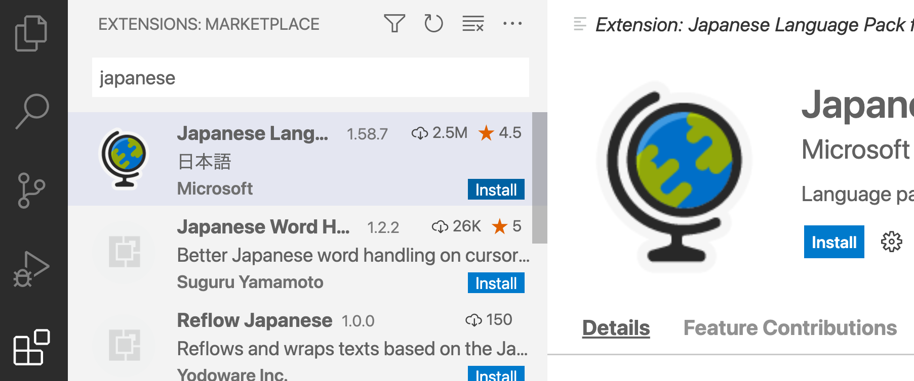

# 開発環境の事前準備

　拡張機能を開発する環境を整えましょう。
ここでは

* Visual Studio Code
* Node.js
* Yaoman
* ESLint
* 日本語化

をインストールします。

## Visual Studio Code

まずはVS Codeが必要になります。
[公式ページ](https://code.visualstudio.com/) (<https://code.visualstudio.com/>) からVS Codeをインストールしましょう。

## Node.js

　VS Codeの拡張機能はNode.jsを利用して開発します。
[Node.jsのページ](https://nodejs.org/)からLTS（_Long Term Support_）バージョンをインストールしましょう。
本章では16.13.0を利用します。

## Yeoman ── ソースコードを自動生成するツール

　プロジェクトを作成するときに一つ一つファイルを作るのは大変です。
そこで以下のコマンドからソースコード自動生成ツールのYaomanと、Yaomanのテンプレートパッケージ`generator-code`をインストールします。

```sh
!!!cmd
$ npm install -g yo generator-code
```

## Visual Studio Code拡張機能

### 日本語化

　初期状態では、VS CodeのUI（User Interface）は英語になっています。
エラーが起きた場合などは英語で検索したほうがヒットしやすいですが、本ハンズオンでは、日本語化を前提に進めます。
英語のままで大丈夫な方は、次のトピックに進んでください。

1. アクティビティバー（画面左端のアイコンメニュー）から拡張機能アイコン（上から5番目のアイコン）を選択する
2. サイドバー（アクティビティバーの右隣のエリア）の「Search Extensions in Marketplace」欄に「japanese」と入力する
3. サイドバー中の項目に「Japanese Language Pack for Visual Studio Code」が出てくるので選択する
4. 右にある「install」（インストール）ボタンを選択する
5. インストール後、画面右下の通知ポップアップに再起動を促す「Would you like to change VS Code's UI language to Japanese and restart?」が表示されるので、「Yes」を選択して再起動を行う



### ESLint

　新しい言語であるため馴染みの薄い人も多いTypeScriptはバグを混入させやすく、コードチェックツールは必須と言えます。
[ESLint](https://eslint.org/)は、JavaScript、TypeScript共通のソースコードチェックツールです。
Marketplaceから[ESlint拡張機能](https://marketplace.visualstudio.com/items?itemName=dbaeumer.vscode-eslint)をインストールして、バグを予防しましょう。

<!-- ### CodeTour

　本ハンズオンのサンプルコードは手順を説明するためにCodeTourを利用します。 -->
