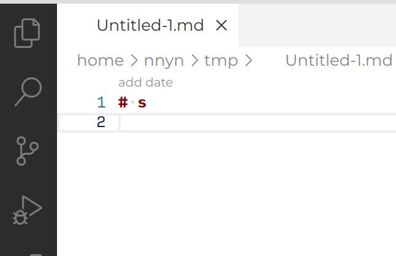
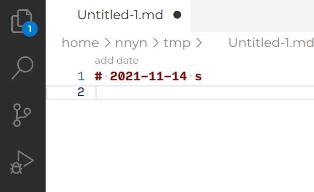

## ドキュメントを編集しよう

本節では、ドキュメント上に表示されるコードレンズのボタンを押して、ドキュメントを編集する拡張機能を作ります。

マークダウンの見出しである `#` が含まれる行に、CodeLens のボタンを用意して、そのボタンが押されたときに Markdown を編集して、日付が追加される機能を実装してみましょう





### この機能の動作手順

ドキュメントを編集する機能が動作するまでの手順は、今回は以下のようにしています。

1. マニフェストファイル package.json の拡張機能が起動する条件である activationPoints に、「Markdown のファイルを開いたとき」の条件を追加して、Markdown を開いたときに拡張機能が起動されるようにします。
2. 拡張機能を追加したときに、CodeLens の情報を提供する部品 CodeLensProvider を作成します。
3. CodeLensProvider はファイルを更新する度に呼び出されます。CodeLensProvider で、ドキュメントを解析し、`#` のある行でコードレンズを登録します。そのコードレンズに、日付を埋め込むコマンド `markdown-date.addDate` を、クリックすると実行するように設定します。このコマンドでは `#` のある場所を引数として渡すようにします。
4. コマンド `markdown-date.addDate` を実行すると、引数の `#` のある場所のテキストを、日付けを追加して編集します。

コマンドをコードレンズのボタン経由で呼び出していますが、前節の Hello World コマンドのように、コマンドを直接定義して実行することも可能です。 1~3 の部分は、コマンドを実行する上でのおまけの機能のため、手っ取り早くコマンドの実装の仕方を知るために、1~3 の部分はコピー&ペーストしていただいても構いません。

### 準備

先に [Hello World を起動しよう](./02_build.md) を行い、TypeScript の拡張機能として、拡張機能を作成してください。

本節では、日付を扱うため、日付を便利に扱う Node パッケージ dayjs をインストールしてください。インストールするには、ターミナルで以下を実行してください。

```
# npm の場合
$ npm install --save dayjs

# yarn の場合
$ yarn add dayjs
```

### 1. Markdown を開いたときに拡張機能が起動するようにする。

拡張機能が起動する条件は、拡張機能のマニフェストファイル package.json の activationEvents に設定します。
activationEvents では、 `onLanguage:<言語ID>` とすると、言語 ID のファイルを開いたときに拡張機能が起動するように設定できます。
このことは、拡張機能が起動するタイミングを、対象の言語 ID のファイルを開いたときにまで遅らせることができます。
多くの拡張機能で適切に activationPoints が設定されていると、VS Code が起動したときに読み込まれる拡張機能が少なくなり、VS Code の起動が早くなると言えます。

```json
// package.json
{
  // 略

  "categories": ["Other"],
  "activationEvents": ["onLanguage:markdown"],
  "main": "./out/extension.js",
  "contributes": {}

  // 略
}
```

activationPoints のリストは [公式ドキュメント](https://code.visualstudio.com/api/references/activation-events) を確認ください。

### 2. 拡張機能が起動したときに CodeLensProvider を起動する

先に、CodeLensProvider のドキュメントを実装しましょう。src/extension.ts に以下のコードを追加してください。

```ts
// src/extension.ts
import * as vscode from "vscode";

export class CodelensProvider implements vscode.CodeLensProvider {
  constructor() {}

  /**
   * ドキュメント変更時に呼ばれる、CodeLensの場所を示すための関数
   */
  public provideCodeLenses(
    document: vscode.TextDocument,
    token: vscode.CancellationToken
  ): vscode.CodeLens[] | Thenable<vscode.CodeLens[]> {
    const codeLenses = [];
    return codeLenses;
  }

  /**
   * ドキュメント中にCodeLensが表示されたときに呼ばれる、CodeLensの詳細を示すための関数
   */
  public resolveCodeLens(
    codeLens: vscode.CodeLens,
    token: vscode.CancellationToken
  ) {}
}
```

CodeLensProvider では、provideCodeLenses と resolveCodeLens の 2 つの関数を用意する必要があります。
関数の中身は次の節で実装しますので、とりあえず CodeLensProvider の形を作成しましょう。

この次に、拡張機能が起動した時にこの CodeLensProvider の実態を作成し、VS Code の API にこの CodeLensProvider を登録します。
拡張機能が起動したときに呼ばれる関数 activate() の中でマークダウンファイルに対して動作するように登録します。

```ts
// src/extension.ts
import { ExtensionContext, languages, Disposable } from "vscode";
let disposables: Disposable[] = [];

export function activate(context: ExtensionContext) {
  const codelensProvider = new CodelensProvider();

  let disposable = languages.registerCodeLensProvider(
    { language: "markdown" },
    codelensProvider
  );
  disposables.push(disposable);
}
```

関数 registerCodeLensProvider の 1 つめの引数には、この CodeLensProvider を有効化する条件である [DocumentSelector](https://code.visualstudio.com/api/references/vscode-api#DocumentSelector) を設定します。
この実装で、言語 ID が markdown のファイルに対して、CodeLensProvider の provideCodeLenses 関数が実行されるようになります。

### 3. ドキュメントを解析して、CodeLens を表示しよう

2.で作成した CodeLensProvider の関数 provideCodeLenses の中でドキュメントを解析し、抽出した範囲に対してコードレンズを登録します。

```ts
const titleRegex = /^#+\s/g;

/**
 * CodelensProvider
 */
export class CodelensProvider implements vscode.CodeLensProvider {
  constructor() {}

  public provideCodeLenses(
    document: vscode.TextDocument,
    token: vscode.CancellationToken
  ): vscode.CodeLens[] | Thenable<vscode.CodeLens[]> {
    const codeLenses = [];

    // ドキュメントの読み取り
    const text = document.getText();

    // 正規表現で、見出しを探す
    const regex = new RegExp(titleRegex);
    let matches;
    while ((matches = regex.exec(text)) !== null) {
      // 見出しが見つかった行を抽出し、
      // その範囲をレンジとして切り出す
      const line = document.lineAt(document.positionAt(matches.index).line);
      const indexOf = line.text.indexOf(matches[0]);
      const position = new vscode.Position(line.lineNumber, indexOf);
      const range = document.getWordRangeAtPosition(
        position,
        new RegExp(titleRegex)
      );
      if (range) {
        // この範囲に対するCodeLensを作成する
        codeLenses.push(
          new vscode.CodeLens(range, {
            title: "add date",
            tooltip: "add date",
          })
        );
      }
    }
    return codeLenses;
  }

  public resolveCodeLens(
    codeLens: vscode.CodeLens,
    token: vscode.CancellationToken
  ) {
    return codeLens;
  }
}
```

ここで、デバッグ実行で拡張機能を実行し、マークダウンファイルを開き、見出しの上に "add date" というコードレンズが表示されることを確認しましょう。


### 4. コマンドを実行してドキュメントを編集しよう

いよいよコマンドを実行して、ドキュメントの内容を編集を行います。

コマンドはすでに HelloWorld のコマンドが登録されていると思いますので、それを書き換えて、`markdown-date.addDate` というコマンドを作成します。
このコマンドでは、引数として、見出しのある箇所を示す `range` が渡されるものとします。

ドキュメントを編集するには、以下のように TextEditor.edit メソッドを使います。
このメソッドは、このメソッド自体でドキュメントを編集するのではなく、メソッドに渡すコールバック関数でドキュメントの編集内容を登録します。

この editBuilder は、[TextEditorEdit](https://code.visualstudio.com/api/references/vscode-api#TextEditorEdit)のオブジェクトで、delete、insert、replace、setEndOfLine の 4 つの編集するメソッドを持っています。
このコールバック関数で、複数回これらのメソッドを呼び出して、複数の箇所を編集することも可能です。
一方で注意することがあります。このコールバック関数中で、前の行の getText() メソッドを呼び出してドキュメントの中身を読み取ることができますが、ここで読み取られる内容はまだ編集が済んでいないものになります。
このメソッドの呼び出しは編集する内容を登録するだけで、呼び出した時に編集が行われるわけではありません。
実際にテキストが編集されるタイミングは、VS Code の中で制御されています。

```ts
let disposables: Disposable[] = [];

export function activate(context: ExtensionContext) {
  const codelensProvider = new CodelensProvider();

  let disposable = languages.registerCodeLensProvider(
    { language: "markdown" },
    codelensProvider
  );
  disposables.push(disposable);

  /**
   * 見出しに日付を追加
   */
  commands.registerCommand("markdown-date.addDate", (range: Range) => {
    // エディターが表示していない時に、コマンドが実行された時にエラーにならないようにする制御
    if (vscode.window.activeTextEditor) {
      // ドキュメントからテキストを読み取り
      const text = vscode.window.activeTextEditor.document.getText(range);

      // dayjs を使って、日付の文字列を生成
      const today = dayjs().format("YYYY-MM-DD");

      // edit関数のコールバック関数で、editBuilder を使い、ドキュメントを編集する
      vscode.window.activeTextEditor.edit((editBuilder) => {
        // 範囲の箇所を新しいテキストに置き換えさせる
        editBuilder.replace(range, text + today + " ");
      });
    }
  });
}
```

これで、テキストを編集するコマンドができました。
このコマンドをコードレンズから呼び出すように、CodeLensProvider を以下のように編集します。

```ts
// src/extension.ts
export class CodelensProvider implements vscode.CodeLensProvider {
  constructor() {}

  public provideCodeLenses(
    document: vscode.TextDocument,
    token: vscode.CancellationToken
  ): vscode.CodeLens[] | Thenable<vscode.CodeLens[]> {
    const codeLenses = [];
    const regex = new RegExp(titleRegex);
    const text = document.getText();
    let matches;
    while ((matches = regex.exec(text)) !== null) {
      // 見出しが見つかった行を抽出し、
      // その範囲をレンジとして切り出す
      const line = document.lineAt(document.positionAt(matches.index).line);
      const indexOf = line.text.indexOf(matches[0]);
      const position = new vscode.Position(line.lineNumber, indexOf);
      const range = document.getWordRangeAtPosition(
        position,
        new RegExp(titleRegex)
      );
      if (range) {
        // この範囲に対するCodeLensを作成する
        codeLenses.push(
          new vscode.CodeLens(range, {
            title: "add date",
            tooltip: "add date",
            // コマンドを追加。範囲をコマンドの引数にする
            command: "markdown-date.addDate",
            arguments: [range],
          })
        );
      }
    }
    return codeLenses;
  }
  // 後略
}
```

これで、CodeLens からコマンドを呼び出す実装ができました。

デバッグ実行を開始してみて、コードレンズが押せるようになっていることを確認してください。コードレンズを押すと、テキストが編集されることを確認してください。


