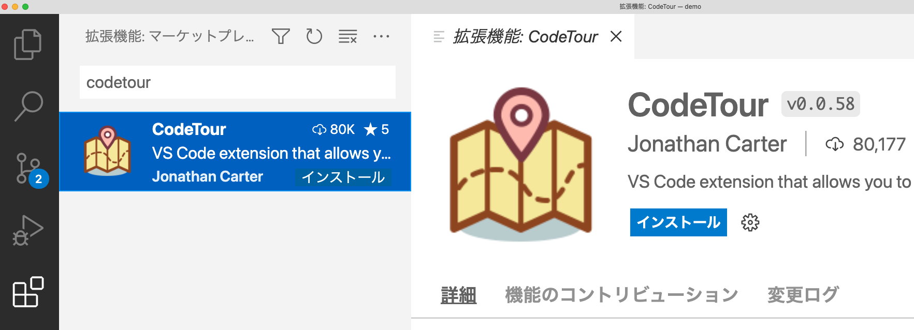
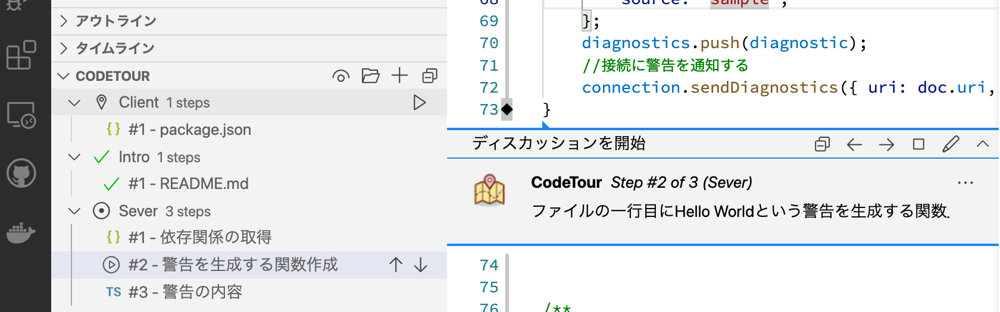

# LSP実装ハンズオンの進め方

本ハンズオンは拡張機能CodeTourを使ってソースコードの解説を行います．
本ハンズオンで利用する資料の解説はCodeTourにも紐付けしています．
ここではCodeTourの使い方を解説します．

## CodeTourのインストール

CodeTourはVS Codeの拡張機能です．
Marketplaceからインストールしてください．

1. アクティビティバーから拡張機能アイコン（上から5番目のアイコン）を選択する
2. サイドバーの「Marketplace で拡張機能を検索する」欄に「codetour」と入力する
3. サイドバー中の項目に「CodeTour」が出てくるので選択する
4. 右にある「インストール」ボタンを選択する

## CodeTourの使い方

サイドバー下 (エディタ左下)の「CODETOUR」ボタンを押すとCodeTourが開きます．

次の画像はCodeTourを起動したときの様子です．
気になる説明をクリックすると関連するコードの解説が表示されます．
本ハンズオンではコード例を利用しますが，具体的な場所を知りたいは活用してみてください．

