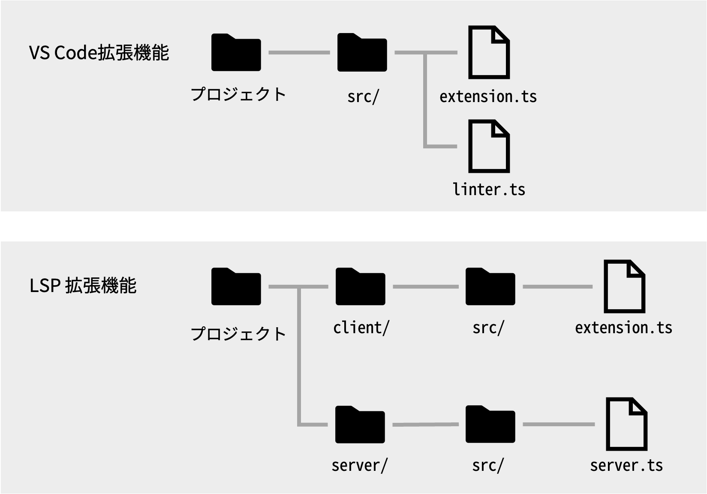

# Language Server Protocol (LSP) とは？

## 仕組み

エディタを利用しているとコード補完機能や自動修正機能などが利用できます．
Language Server Protocol (LSP)はそれらの機能をあらゆるエディタで提供するプロトコルです．

## 通常の拡張機能と比べた実装の違い

以下の図はざっくりしたファイル構成の違いです．
通常の拡張機能であれば，エディタのUIもリンターなどの言語機能も同一プロジェクトして管理します．
一方でLSPは，エディタのフロント側をクライアント，言語機能側をサーバーとして提供します．

次の節ではLSPとして実装する利点を説明します．

## LSPで実装する利点

クライアント側とサーバー側に分けることで大きく３つの利点があります．

参考文献: <https://code.visualstudio.com/api/language-extensions/language-server-extension-guide#why-language-server>

### 利点1: 複数エディタへの機能提供

一番の目的です．
LSPではクライアント（エディタ）側とサーバー（言語機能）側に実装を分けています．
なので，サーバー側のみを利用すればVimやSublime Text，Eclipseといったエディタ利用者も，それぞれのエディタで言語機能を使うことができます．

以下の図は[公式ページ](https://code.visualstudio.com/api/language-extensions/language-server-extension-guide)から参照したエディタの対応図です．

### 利点2: 実装言語選択の自由

通常の拡張機能はNode.js (JavaScriptやTypeScript)により実装されています．
LSPを利用することで，サーバー側が提供する機能を好きな言語で実装できます．
例えば，サーバー側をPythonのLSPならPython，C#のLSPならC#を用いてサーバーを実装しています．
本ハンズオンではクライアントとサーバー側両方でTypeScriptを使用しますが，興味があればお好きな言語でも挑戦してみてください．

### 利点3: 計算リソースの独立

検証機能などでファイルを解析するにはそれなりのCPUやメモリのリソースが必要です．
そういった計算にはVS Code側のパフォーマンスに影響を与えることがあります．
LSPを用いて言語機能とエディタ機能を独立させることで，それらのパフォーマンスを抑えることができます．

## おすすめ参考実装

通常の拡張機能実装でもリンターや自動補完は実装できますが，多くのVS Codeの言語サポート拡張機能はLSPを利用しています．
お手本となるプロジェクトを参考に機能を実装するためにも，LSPを利用をおすすめします．

例えば本ハンズオンでは，

* [公式サンプルプロジェクト](https://github.com/microsoft/vscode-extension-samples/tree/main/lsp-sample): 安定している実装
* [ESLintサーバー](https://github.com/microsoft/vscode-eslint): LSPの最新機能を利用しているサーバー

を参考にしています．

多くの実装は[Language Server実装集](https://microsoft.github.io/language-server-protocol/implementors/servers/)にあります．
以下にさらに細分化した実装，とくにTypeScriptでの実装例を紹介します．

### おすすめ1: [VS Code組み込み拡張機能](https://github.com/microsoft/vscode/tree/main/extensions)

VS Codeにデフォルトで組み込まれている拡張機能です．以下の３つがLSPを利用している拡張機能で，主に補完機能をサポートしています．

* [HTML](https://github.com/microsoft/vscode/tree/main/extensions/html-language-features)
* [CSS/LESS/SASS](https://github.com/microsoft/vscode/tree/main/extensions/css-language-features)
* [JSON](https://github.com/microsoft/vscode/tree/main/extensions/json-language-features)

### おすすめ2: Microsoft謹製のLSPサーバー

LSP本家であるMicrosoftが作成しているLSPサーバーです．

* [Docker Compose](https://github.com/microsoft/compose-language-service)
* [T-SQL](https://github.com/Microsoft/vscode-mssql/tree/dev/src/languageservice)
* [Mongo DB](https://github.com/microsoft/vscode-cosmosdb/tree/328a2cb675cedb012869411cdd739587363a55fa/src/mongo)
