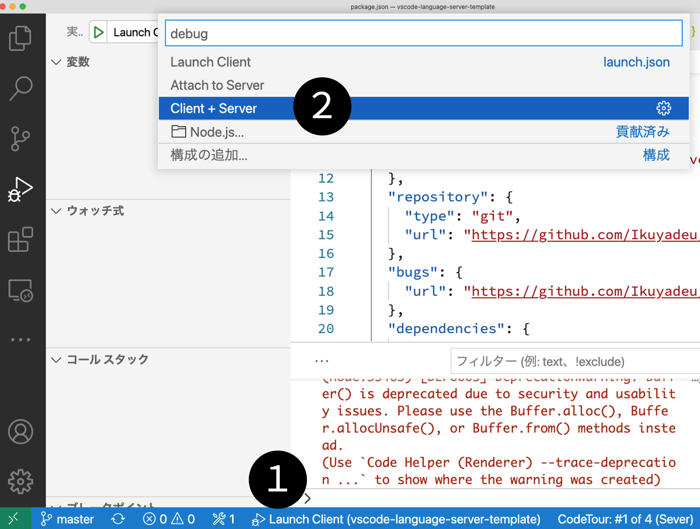

# Hello Language Server Protocol

## はじめに

本コースでは[**L**anguage **S**erver **P**rotocol](https://microsoft.github.io/language-server-protocol/) (以下，**LSP**)を用いたエディタの拡張機能開発を行います．
LSPとは，コード補完や，変数参照，スタイル修正といった機能実装を[あらゆるエディタ/IDE](https://microsoft.github.io/language-server-protocol/implementors/tools/) へ提供するプロトコルです．

## 今回行うこと

* Hello Worldを表示 (本ドキュメント)
* [Linterコース](https://github.com/vscodejp/handson-hello-vscode-extension/blob/main/docs/expert/02_linter.md)
  * [特定の文字列に対して警告を出す](https://github.com/vscodejp/handson-hello-vscode-extension/blob/main/docs/expert/02_linter.md#%E8%AD%A6%E5%91%8A%E6%A9%9F%E8%83%BD%E3%81%AE%E5%AE%9F%E8%A3%85)
  * [警告に対して自動修正を行う](https://github.com/vscodejp/handson-hello-vscode-extension/blob/main/docs/expert/02_linter.md#%E8%87%AA%E5%8B%95%E4%BF%AE%E6%AD%A3%E6%A9%9F%E8%83%BD%E3%81%AE%E5%AE%9F%E8%A3%85)
* [補完機能コース](https://github.com/vscodejp/handson-hello-vscode-extension/blob/main/docs/expert/03_compaleson.md)
  * "VS Code", "Visual Studio Code"を補完入力する

## 開発環境

* [Visual Studio Code](https://code.visualstudio.com/)
* [Node JS](https://nodejs.org/) x64, version >= 16.x, < 17.x

## Hello World

コンピュータープログラミングにおける古来の伝統に従い，最初に作るアプリケーションは「Hello World」を表示するプログラムにしましょう．

[簡素なテンプレート](https://github.com/vscodejp/vscode-language-server-template)を用意しましたのでそれをクローンしてVS Codeで開きましょう．

```sh
git clone https://github.com/vscodejp/vscode-language-server-template.git
code vscode-language-server-template
```

### ビルド

1: ターミナルを起動
[表示] -> [統合ターミナル]
または，`Control` + \` (Macなら `^` + \`)

2: 以下のコマンドを実行し，必要なパッケージのインストールを行います．

```sh
npm install
```

3: サイドバーのデバッグ(上から4番目のアイコン)から`Launch Client`を選択し，`Client+Server`を選び実行ボタンを押す (または単に`F5` キーを入力する)ことで拡張機能をインストールしたVS Codeを立ち上げます．



4: 開いたエディタ上で`.txt`ファイル，もしくは`.md`ファイルを開いてみましょう．ない場合は新たに`test.txt`などの文章を作成しましょう．
画像では`test.txt`の１行目に波線を表示させ，その上にマウスを置くと`Hello World`と表示させています．


### ファイル構成

以下がVS CodeでLSPを実装するときの一般的なファイルの構成です．
本記事ではサーバー側のメインである`server/src/server.ts`を編集していきます．

```
.
├── client               // Language Serverのクライアントサイド
│   ├── src
│   │   └── extension.ts // クライアント側拡張機能のソースコード
│   └── package.json     // クライアント側として利用するパッケージ情報
│
├── server               // Language Serverのサーバーサイド
│   │── src
│   │   └── server.ts    // Language Serverのメインソースコード
│   │── package.json     // クライアント側として利用するパッケージ情報
│   └── README.md        // サーバーとしてのREADME.md (説明書)
│
├── package.json         // VS Codeプラグインとしてのパッケージ情報 
└── README.md            // VS CodeプラグインとしてのREADME.md(説明書)
```

## ソースコード解説

### 拡張機能のメタファイル`package.json`

今回は起動条件 (activationEvents) に `onLanguage:plaintext`と`onLanguage:markdown` つまり，プレーンテキストやマークダウンファイルを(拡張子が.txtまたは.md)開いた時を追加しています．

```json
...
	"activationEvents": [
		"onLanguage:plaintext",
		"onLanguage:markdown"
	],
...
```

実行環境は`vscode`の1.61.0以上を前提としています．
バージョンによってはAPIの利用方法が変わるので注意です．

```json
...
	"engines": {
		"vscode": "^1.61.0"
	},
...
```

利用する依存関係として，Language Serverと連携する`vscode-languageclient`と， UIなどエディタ側の機能を提供する`vscode`を使います．

```json
...
	"devDependencies": {
		"@types/vscode": "1.61.0"
	},
	"dependencies": {
		"vscode-languageclient": "8.0.0-next.4"
	}
...
```

### クライアント側のソースコード

こちらは長めなので展開式にしています．
クライアント側のソースコードファイルは通常のVS Code拡張機能として実装しているため，VS Code APIを利用します．
現在バージョンのクライアントパッケージは`vscode-languageclient/node`から呼び出せます．`vscode-languageclient`と間違えないよう注意してください．

<details><summary>クライアント側のソースコード`client/src/extension.ts`</summary><div>

```ts:client/src/extension.ts
'use strict';

import { ExtensionContext, window as Window, Uri } from 'vscode';
import {
	LanguageClient,
	LanguageClientOptions,
	RevealOutputChannelOn,
	ServerOptions,
	TransportKind } from 'vscode-languageclient/node';

// 拡張機能が有効になったときに呼ばれる
export function activate(context: ExtensionContext): void {
	// サーバーのパスを取得
	const serverModule =  Uri.joinPath(context.extensionUri, 'server', 'out', 'server.js').fsPath;
	// デバッグ時の設定
	const debugOptions = { execArgv: ['--nolazy', '--inspect=6011'], cwd: process.cwd() };

	// サーバーの設定
	const serverOptions: ServerOptions = {
		run: {
			module: serverModule,
			transport: TransportKind.ipc,
			options: { cwd: process.cwd() }
		},
		debug: {
			module: serverModule,
			transport: TransportKind.ipc,
			options: debugOptions,
		},
	};
	// LSPとの通信に使うリクエストを定義
	const clientOptions: LanguageClientOptions = {
		// 対象とするファイルの種類や拡張子
		documentSelector: [
			{ scheme: 'file' },
			{ scheme: 'untitled' }
		],
		// 警告パネルでの表示名
		diagnosticCollectionName: 'sample',
		revealOutputChannelOn: RevealOutputChannelOn.Never,
		initializationOptions: {},
		progressOnInitialization: true,
	};

	let client: LanguageClient;
	try {
		// LSPを起動
		client = new LanguageClient('Sample LSP Server', serverOptions, clientOptions);
	} catch (err) {
		void Window.showErrorMessage('拡張機能の起動に失敗しました。詳細はアウトプットパネルを参照ください');
		return;
	}

	// 拡張機能のコマンドを登録
	context.subscriptions.push(
		client.start(),
	);
}
```
</div></details>

### サーバー側のソースコード

サーバー側のソースコードは`server/src/server.ts`と`server/src/package.json`です．
これらはクライアント側の依存関係とは独立しています．

<details><summary>サーバー側のソースコード`server/src/server.ts`</summary><div>

```ts:server/src/server.ts
'use strict';

import {
	createConnection,
	Diagnostic,
	DiagnosticSeverity,
	ProposedFeatures,
	Range,
	TextDocuments,
	TextDocumentSyncKind,
} from 'vscode-languageserver/node';
import { TextDocument } from 'vscode-languageserver-textdocument';

// サーバー接続オブジェクトを作成する。この接続にはNodeのIPC(プロセス間通信)を利用する
// LSPの全機能を提供する
const connection = createConnection(ProposedFeatures.all);
connection.console.info(`Sample server running in node ${process.version}`);
// 初期化ハンドルでインスタンス化する
let documents!: TextDocuments<TextDocument>;

// 接続の初期化
connection.onInitialize((_params, _cancel, progress) => {
	// サーバーの起動を進捗表示する
	progress.begin('Initializing Sample Server');
	// テキストドキュメントを監視する
	documents = new TextDocuments(TextDocument);
	setupDocumentsListeners();
	// 起動進捗表示の終了
	progress.done();

	return {
		// サーバー仕様
		capabilities: {
			// ドキュメントの同期
			textDocumentSync: {
				openClose: true,
				change: TextDocumentSyncKind.Incremental,
				willSaveWaitUntil: false,
				save: {
					includeText: false,
				}
			}
		},
	};
});

/**
 * テキストドキュメントを検証する
 * @param doc 検証対象ドキュメント
 */
function validate(doc: TextDocument) {
	// 警告などの状態を管理するリスト
	const diagnostics: Diagnostic[] = [];
	// 0行目(エディタ上の行番号は1から)の端から端までに警告
	const range: Range = {start: {line: 0, character: 0},
		end: {line: 0, character: Number.MAX_VALUE}};
	// 警告を追加する
	const diagnostic: Diagnostic = {
		// 警告範囲
		range: range,
		// 警告メッセージ
		message: 'Hello world',
		// 警告の重要度、Error, Warning, Information, Hintのいずれかを選ぶ
		severity: DiagnosticSeverity.Warning,
		// 警告コード、警告コードを識別するために使用する
		code: '',
		// 警告を発行したソース、例: eslint, typescript
		source: 'sample',
	};
	diagnostics.push(diagnostic);
	//接続に警告を通知する
	connection.sendDiagnostics({ uri: doc.uri, diagnostics });
}


/**
 * ドキュメントの動作を監視する
 */
function setupDocumentsListeners() {
	// ドキュメントを作成、変更、閉じる作業を監視するマネージャー
	documents.listen(connection);

	// 開いた時
	documents.onDidOpen((event) => {
		validate(event.document);
	});

	// 変更した時
	documents.onDidChangeContent((change) => {
		validate(change.document);
	});

	// 保存した時
	documents.onDidSave((change) => {
		validate(change.document);
	});

	// 閉じた時
	documents.onDidClose((close) => {
		// ドキュメントのURI(ファイルパス)を取得する
		const uri = close.document.uri;
		// 警告を削除する
		connection.sendDiagnostics({ uri: uri, diagnostics: []});
	});
}

// Listen on the connection
connection.listen();
```
</div></details>
