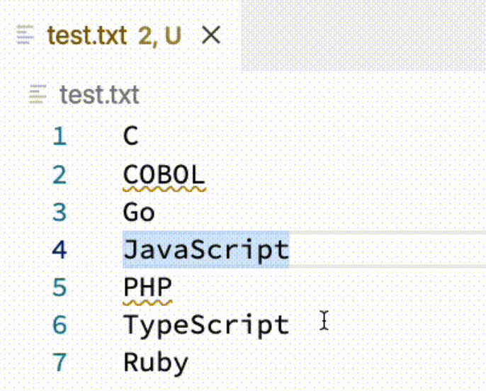

# リンターツールの実装

本コースではリンター，つまりコードの検証や自動修正を行うツールを開発します。

## ブランチ切り替え

補完機能の実装CodeTourを使うためには，ブランチを切り替える必要があります．

```sh
git checkout -b linter
```

## 警告機能の実装

次に，大文字に対して警告文を出す実装を行います．
サーバーのソースコード`server/src/server.ts`の関数`validate`を以下の通りに書き換えてみましょう．

```ts:server/src/server.ts
/**
 * 大文字に対して警告を表示する
 */
function validate(doc: TextDocument) {
    // ２つ以上並んでいるアルファベット大文字を検出
    const text = doc.getText();
    // 検出するための正規表現 (正規表現テスト: https://regex101.com/r/wXZbr9/1)
    const pattern = /\b[A-Z]{2,}\b/g;
    let m: RegExpExecArray | null;
    
    // 警告などの状態を管理するリスト
    const diagnostics: Diagnostic[] = [];
    // 正規表現に引っかかった文字列すべてを対象にする
    while ((m = pattern.exec(text)) !== null) {
        // 対象の位置から正規表現に引っかかった文字列までを対象にする
        const range: Range = {start: doc.positionAt(m.index),
                              end: doc.positionAt(m.index + m[0].length),
        };
        // 警告内容を作成，上から範囲，メッセージ，重要度，ID，警告原因
        const diagnostic: Diagnostic = Diagnostic.create(
            range,
            `${m[0]} is all uppercase.`,
            DiagnosticSeverity.Warning,
            "",
            "sample",
        );
        // 警告リストに警告内容を追加
        diagnostics.push(diagnostic);
    }

    // Send the computed diagnostics to VSCode.
    connection.sendDiagnostics({ uri: doc.uri, diagnostics });
}
```

もう一度`F5`キーで実行し以下のファイルを作ってみましょう

```txt:README.md
TypeScript lets you write JavaScript the way you really want to.
TypeScript is a typed superset of JavaScript that compiles to plain JavaScript.
ANY browser. ANY shost. ANY OS. Open Source.
```

ファイル中の大文字列`COBOL`や`PHP`に対して以下のように波線で警告が出るはずです．
逆に一文字だけの`C`などには警告は出ません．



## 自動修正機能の実装

警告だけに終わらず，自動的に修正する機能を実装していきます．今回は大文字を小文字にしていきます．

引き続き，`server/src/server.ts`を編集します．`import`以下と関数`setupDocumentsListeners`を以下のコードに編集してみましょう．ここまでの過程で，つまづいた場合は[出来上がったもの](https://github.com/Ikuyadeu/vscode-language-server-template/tree/completed)を`completed`ブランチとして用意してありますのでそちらをご利用ください．


まずは`import`部分を以下のコードに編集してみましょう．

```ts:import文
import {
    CodeAction,
    CodeActionKind,
    createConnection,
    Diagnostic,
    DiagnosticSeverity,
    Range,
    TextDocumentEdit,
    TextDocuments,
    TextDocumentSyncKind,
    TextEdit,
} from "vscode-languageserver";
```

次に`setupDocumentsListeners`関数を以下のコードに編集してみましょう．

```ts:関数setupDocumentsListeners
function setupDocumentsListeners() {
    documents.listen(connection);

    documents.onDidOpen((event) => {
        validate(event.document);
    });

    documents.onDidChangeContent((change) => {
        validate(change.document);
    });

    documents.onDidClose((close) => {
        connection.sendDiagnostics({ uri: close.document.uri, diagnostics: []});
    });

    // Code Actionを追加する
    connection.onCodeAction((params) => {
        // sampleから生成した警告のみを対象とする
        const diagnostics = params.context.diagnostics.filter((diag) => diag.source === "sample");
        // 対象ファイルを取得する
        const textDocument = documents.get(params.textDocument.uri);
        if (textDocument === undefined || diagnostics.length === 0) {
            return [];
        }
        const codeActions: CodeAction[] = [];
        // 各警告に対してアクションを生成する
        diagnostics.forEach((diag) => {
            // アクションの目的
            const title = "Fix to lower case";
            // 警告範囲の文字列取得
            const originalText = textDocument.getText(diag.range);
            // 該当箇所を小文字に変更
            const edits = [TextEdit.replace(diag.range, originalText.toLowerCase())];
            const editPattern = { documentChanges: [
                TextDocumentEdit.create({uri: textDocument.uri,
                                         version: textDocument.version},
                                        edits)] };
            // コードアクションを生成
            const fixAction = CodeAction.create(title,
                                                editPattern,
                                                CodeActionKind.QuickFix);
            // コードアクションと警告を関連付ける
            fixAction.diagnostics = [diag];
            codeActions.push(fixAction);
        });

        return codeActions;
    });

}
```

## 実際に使ってみる

F5キー(環境によってはfn + F5キー)で実行してみましょう．

警告に電球マークが付き，クリックすると該当箇所を小文字に修正します．


## 発展課題

* 好きなリンター機能を実装してみよう．
  * `VSCode`や`VS code`を`VS Code`に修正するリンターを作ろう．
  * その他よくある間違いを修正するリンターを作ろう．(例えば`Javascript`を`JavaScript`に修正するリンター)
* （まだなら）[コースBの補完機能](https://github.com/vscodejp/handson-hello-vscode-extension/blob/main/docs/expert/03_completion.md)を実装してみよう．
