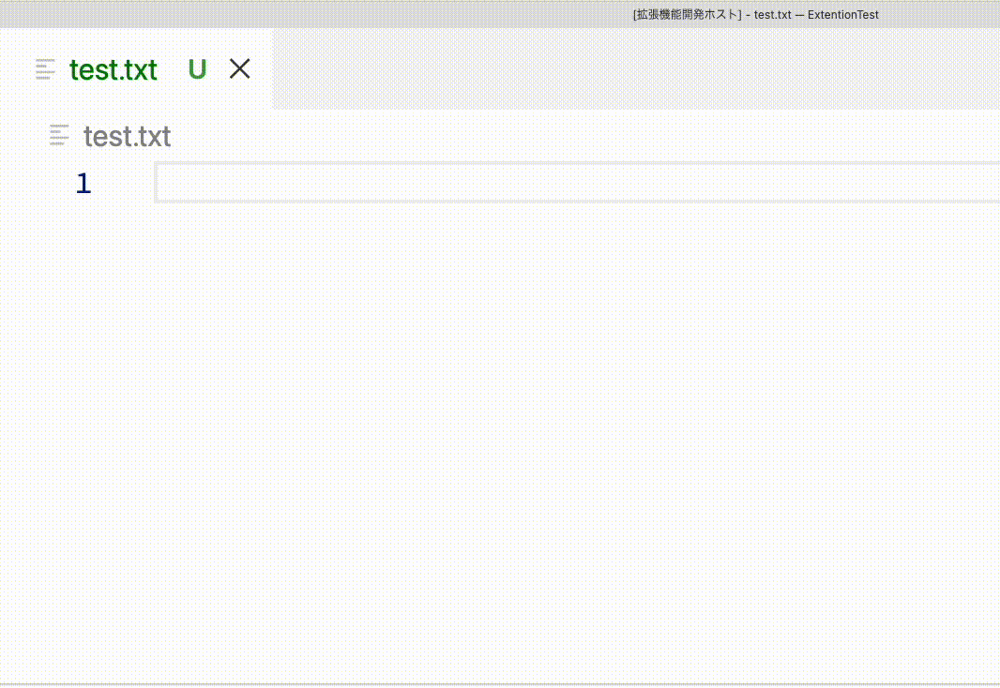
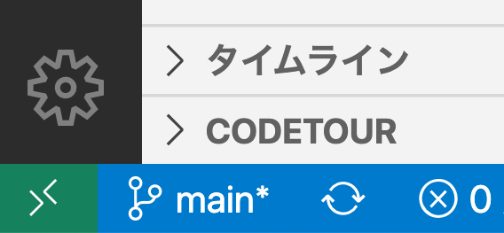

# コード補完機能を実装しよう

このドキュメントでは自動的にVS Codeと補完する機能を実装します．



## ブランチ切り替え

補完機能の実装用CodeTourを使うためには，ブランチを切り替える必要があります．
以下のコマンドを実行するか，エディタの左下のブランチ名`main`をクリックし，`origin/linter`を選んでください．

```sh
git checkout -b completions origin/completions
git checkout completions
```



## サーバー設定

補完機能を実装するためには，サーバーの初期化設定に以下のコードを追加する必要があります．

```ts
connection.onInitialize((params): InitializeResult => {
    ...
    return {
        capabilities: {
            ...
            // Tell the client that the server supports code completion
            completionProvider: {
                resolveProvider: true
            }
        }
    };
});
```

## 補完機能部分の定義

それでは実際に補完機能を実装します．

まずは，ドキュメントを監視し，補完する文字列を定義します．
`setupDocumentsListeners`を以下のように書き換えましょう．
今回は1行目でvを入力すると`VS Code`，`Visual Studio Code`の２つを補完します．
ここでは，`textDocumentPosition`からカーソルの位置を取得しています．

```ts
function setupDocumentsListeners() {
	// ドキュメントを作成、変更、閉じる作業を監視するマネージャー
	documents.listen(connection);
	// 補完機能の要素リスト
	connection.onCompletion(
		(textDocumentPosition: TextDocumentPositionParams): CompletionItem[] => {
			// 1行目の場合はVS CodeとVisual Studio Codeを返す
			if (textDocumentPosition.position.line === 0) {
				return [
					{
						// 補完を表示する文字列
						label: 'VS Code',
						// コード補完の種類、ここではTextを選ぶがMethodなどもある
						kind: CompletionItemKind.Text,
						// 補完リスト上でのラベル
						data: 1
					}, {
						// 補完を表示する文字列
						label: 'Visual Studio Code',
						// コード補完の種類、ここではTextを選ぶがMethodなどもある
						kind: CompletionItemKind.Text,
						// 補完リスト上でのラベル
						data: 1
					}
				];
			}
		}
	);
}
```

さらに，２行目以降の動作を追加します．
`textDocumentPosition`を使ってファイルパスを取得し，補完を行います．

```ts
	connection.onCompletion(
		...
			// 2行目以降はファイル名を返す
			const fileUri = textDocumentPosition.textDocument.uri;
			return [
				{
					label: fileUri.substr(fileUri.lastIndexOf('/') + 1),
					kind: CompletionItemKind.Text,
					data: 2
				}
			];
		...
	);
```

次に`setupDocumentsListeners`の中でラベル付けされた補完リストの詳細を定義する関数を定義します．

```ts
function setupDocumentsListeners() {
    ...
	// ラベル付けされた補完リストの詳細を取得する
	connection.onCompletionResolve(
		(item: CompletionItem): CompletionItem => {
			if (item.data === 1) {
				// 詳細名
				item.detail = 'VS Code 詳細';
				// 詳細ドキュメント
				item.documentation = 'Visual Studio Code 詳細ドキュメント';
			} else if (item.data === 2) {
				item.detail = '現在のファイル名';
				item.documentation = 'ファイル名 詳細ドキュメント';
			}
			return item;
		}
	);
}
```

## 実際に使ってみる

`Launch Client`またはF5キーで実行してみましょう．

冒頭のgifと同様に，1行目でvを入力すると`VS Code`と`Visual Studio Code`の２つが表示されます．
また，2行目以降でファイル名を入力すると現在のファイル名が表示されるはずです．

## 発展課題

* 好きな言語の補完機能を実装してみましょう．(package.jsonでの対応言語設定(`activationEvent`)を忘れないように)
  * 標準入力 (`int(input())`など)と標準出力 (print文など)を補完してみましょう．
  * 補完機能を実装したら，テストしましょう．
* （まだなら）[コースAのリンター機能](https://github.com/vscodejp/handson-hello-vscode-extension/blob/main/docs/expert/02_linter.md)を実装してみましょう．
